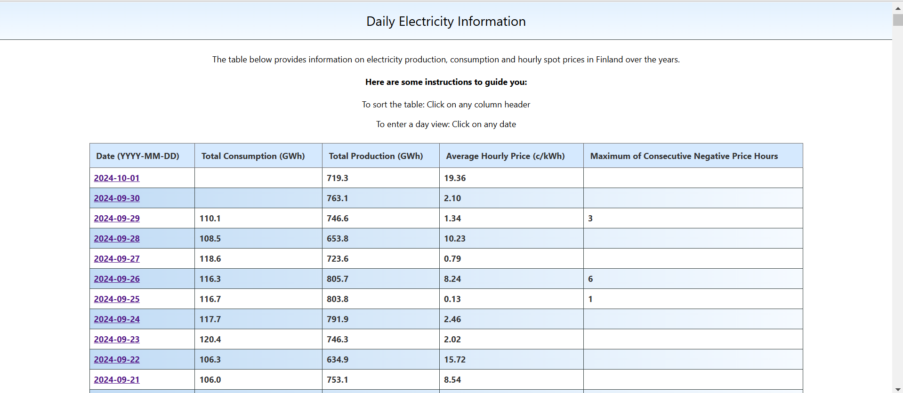
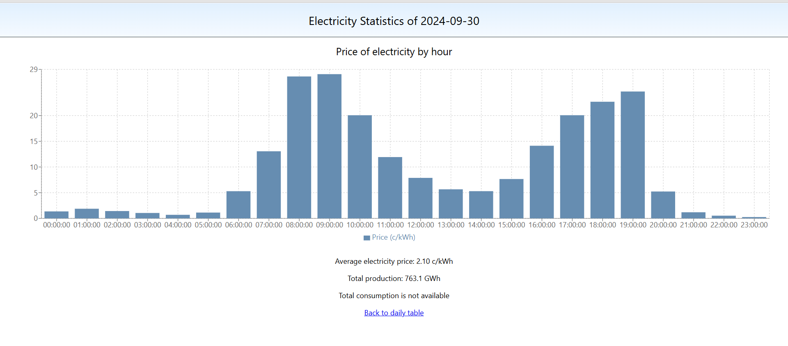

# Solita Dev Academy Spring 2025 Pre Assignment

This repository holds a web application that presents electricity production, consumption and spot price data over the years in Finland. The application was implemented as a pre assignment for Solita's Dev Academy Spring 2025, using mainly Typescript. The electricity consupmtion and production data originates from Fingrid and the price data from [http://porssisahko.net](http://porssisahko.net).

# Table of contents
1. [Implementation](#introduction)
    1. [Backend](#backend)
    2. [Frontend](#frontend)
2. [Running the application](#running)
3. [Running E2E tests](#testing)


## Implementation <a name="technologies"></a>
### Backend
The backend is a Node.js application that uses TypeORM and Typescript. TypeORM is an ORM (Object Relational Mapper) that supports many database maangement systems and can also be used for non-relational databases.
### Frontend
The frontend of the application is a React application, with two distinct routes/views. The main view at localhost:3000 presents a table of total electricity production and consumption of each day as well as the average price and maximum consecutive negative hours (when applicable). The table can be sorted by each column.



The route localhost:3000/dates/:date gives a graph visualization of a date's electricity spot prices per hour as well as the total production and consumption and averge price for the day.




## Running the application
Run the database using the instructions in Solita's pre assignment repository
[here](https://github.com/solita/dev-academy-spring-2025-exercise?tab=readme-ov-file#instructions-for-running-the-database).

1. Install Node.js ([https://nodejs.org/en/download](https://nodejs.org/en/download))

2. Clone this repository

3. Under the /backend folder, run

```
npm install
```

(This installs the needed dependencies for the project.)

4. After the dependencies are installed, run (under /backend)

```
npm run start
```
To start the backend. The backend is running at [http://localhost:3003/electricity](http://localhost:3003/electricity).

5. Similarly under /frontend/electricity-app, run
```
npm install
```

6. And finally under /frontend/electricity-app, run
```
npm start
```
To launch the React application. The application should launch on its own, but you can view it at [http://localhost:3000](http://localhost:3000).

## Running E2E tests

E2E tests are located in the frontend side and can be run under the /frontend/electricity-app folder with
```
npm run cypress:open
```
After running the command, choose "E2E Testing" and select a browser to run the tests on. Then select "electricty_app" from the menu and the tests should run automatically. Make sure the backend and frontend are up and working before running the E2E tests.

The E2E tests include checks for rendering content, navigating between views and sorting the table based on different values.